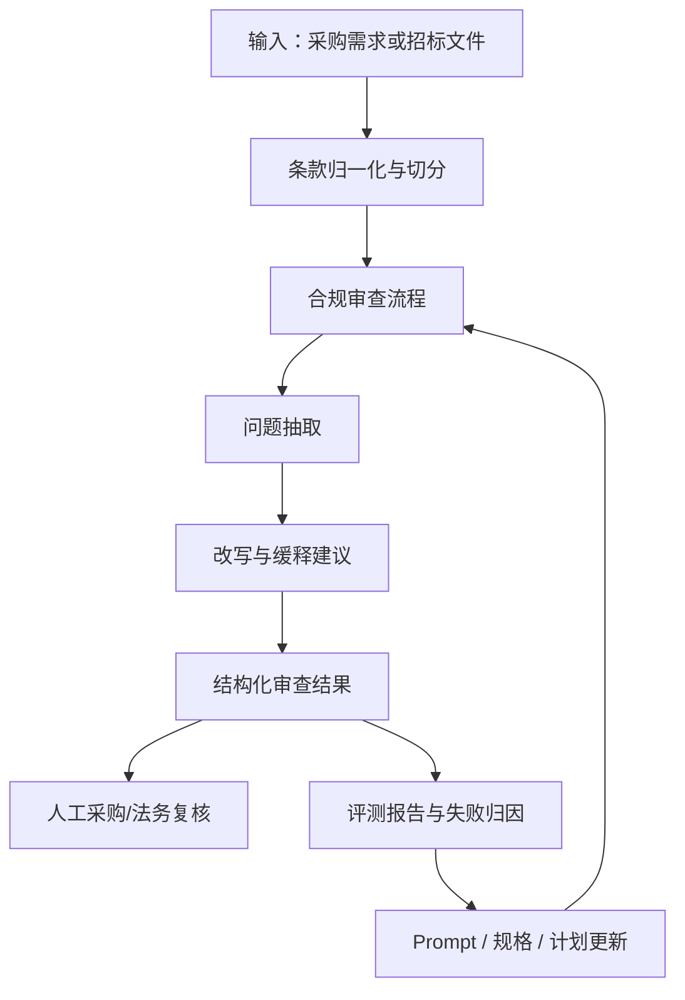

# 架构设计

## 为什么这个仓库要按 harness 方式组织

参考 OpenAI 的 harness engineering 与 Codex agent loop 思路，这个项目不把智能体视为一次性问答器，而是视为在持续工作环境中运行的执行者。

这意味着仓库必须帮助智能体做到：
- 快速找到当前有效信息
- 理解产品目标和领域规则
- 跟踪尚未完成的工作
- 留下可供后续循环检查的产物
- 通过显式评测与反馈持续改进质量

## 顶层运行模型

## 仓库分层

- `AGENTS.md`：供后续智能体循环快速读取的简明操作说明。
- `README.md`：仓库入口。
- `ARCHITECTURE.md`：系统地图，以及为什么要这样组织。
- `docs/design-docs/`：更深入的设计理由、权衡与决策。
- `docs/product-specs/`：对“合规审查行为”的操作性定义。
- `docs/exec-plans/`：可恢复的任务状态与下一步动作。
- `docs/evals/`：基准样例、评分规则与评测报告。
- `docs/generated/`：样例输出与未来运行产物。
- `docs/references/`：与外部架构方法对应的参考说明。

## 这个智能体的设计原则

### 1. 优先保证智能体可读性，而不是隐藏式聪明

审查智能体应当清楚暴露：
- 是哪一条款触发了风险判断
- 风险属于什么类型
- 依据是什么
- 哪些地方仍然不确定

### 2. 顶层文件短小，深层文档承载细节

顶层文件负责帮助智能体快速定位；更详细的规则、例外、案例与政策细节放到 `docs/` 深层目录中。

### 3. 计划是第一类状态

工作状态不能只留在上下文里。当前任务必须写入活动执行计划，方便后续循环直接续跑，而不是重新猜测上下文。

### 4. 评测驱动改进

一个合规检查智能体只有在“持续抓到真正的问题、同时控制误报”时才有价值。因此仓库必须为这些内容预留空间：
- 代表性样例集
- 评分 rubric
- 失败分析
- prompt 与规格迭代

### 5. 人工升级复核是设计的一部分

有些政府采购问题高度依赖地域规则、时效性政策或上下文完整性。harness 应明确把这些情况暴露出来，而不是伪装成确定答案。

## 功能模块

### 输入与切分

职责：
- 接收原始采购文本或从文件提取出的文本
- 按章节、条款、表格行或需求项进行切分
- 保留原始编号，确保可追溯

### 合规分析

职责：
- 识别带有歧视性或排他性的供应商条件
- 识别品牌、型号、产地、资质或性能要求是否过度具体
- 识别与合同履约能力无关的评分因素
- 识别模糊或不可验证的验收与服务条款
- 区分明显违规、存在风险、需要人工复核三类结论

### 改写引擎

职责：
- 提供中性、基于功能或性能的替代表述
- 保留采购人的合法业务需求
- 降低对品牌或特定供应商的绑定
- 在可能时把模糊要求改成可量化要求

### 报告层

职责：
- 生成结构化问题清单
- 保留源条款引用
- 提供置信度和复核说明
- 支持人工审批与后续流转

### 评测层

职责：
- 运行整理好的基准样例
- 将输出与预期标签对比
- 捕获误报与漏报
- 把结果反馈回规格与 prompt

## 建议的产物格式

每条 finding 建议至少包含：
- `source_section`
- `source_text`
- `risk_type`
- `severity`
- `analysis`
- `legal_or_policy_basis`
- `confidence`
- `rewrite_suggestion`
- `needs_human_review`

## 近期建设顺序

1. 先定义操作性的审查流程。
2. 再定义 finding schema 和严重度模型。
3. 建立首批包含明显案例与边界案例的评测集。
4. 补充生成式样例输出。
5. 根据观测到的失败持续迭代 prompt 和 rubric。
