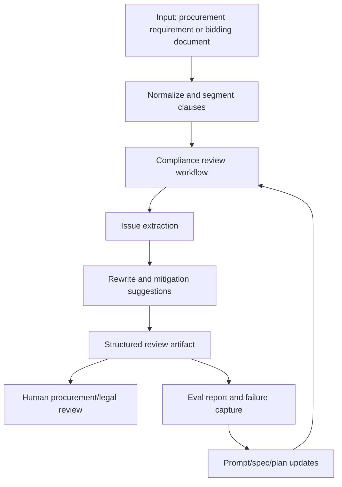

# Architecture

## Why this repository is structured like a harness

Following OpenAI's harness engineering and Codex agent-loop guidance, this project treats the agent as an operator inside a persistent work environment rather than a one-shot reviewer.

That means the repository must help an agent:
- find the current truth fast
- understand the product and domain rules
- keep track of unfinished work
- leave behind artifacts that future loops can inspect
- improve quality through explicit evals and feedback

## Top-level operating model

## Repository layers

- `AGENTS.md`: short operating instructions for any future agent loop.
- `README.md`: quick entry point.
- `ARCHITECTURE.md`: the system map and why the map exists.
- `docs/design-docs/`: deeper rationale, tradeoffs, and design decisions.
- `docs/product-specs/`: the operational definition of compliant review behavior.
- `docs/exec-plans/`: resumable task state and next actions.
- `docs/evals/`: benchmark cases, rubrics, and score reports.
- `docs/generated/`: sample outputs and future run artifacts.
- `docs/references/`: concise notes tying this repo back to external architecture guidance.

## Design principles for this agent

### 1. Agent legibility over hidden cleverness

The review agent should expose:
- which clause triggered a concern
- what kind of risk it believes exists
- what evidence supports that judgment
- what remains uncertain

### 2. Short maps, deep docs

Top-level files should help an agent route itself quickly. Detailed doctrine, examples, and policy nuance belong deeper in `docs/`.

### 3. Plans are first-class state

Work should not disappear into memory. Current work belongs in an active execution plan so a later loop can resume without reconstructing everything.

### 4. Evals drive improvement

A compliance agent is only useful if it repeatedly catches the right issues and avoids false positives. The repository therefore reserves explicit space for:
- representative case sets
- scoring rubrics
- failure analysis
- prompt and spec refinements

### 5. Human escalation is part of the design

Some procurement questions depend on jurisdiction, current regulation, or document context outside the excerpt provided. The harness should surface these clearly instead of pretending certainty.

## Functional modules

### Intake and segmentation

Responsibilities:
- accept raw procurement text or file-derived text
- split by section, clause, table row, or requirement item
- preserve original numbering for traceability

### Compliance analysis

Responsibilities:
- detect discriminatory or exclusionary supplier conditions
- detect brand, model, origin, certification, or performance requirements that may be overly specific
- detect scoring factors unrelated to contract performance
- detect vague or unverifiable acceptance and service clauses
- distinguish likely violation, possible risk, and needs-human-review

### Rewrite engine

Responsibilities:
- propose neutral, performance-based alternatives
- preserve the buyer's legitimate functional need
- reduce brand- or supplier-locking language
- turn vague demands into measurable criteria where possible

### Reporting layer

Responsibilities:
- generate a structured finding list
- preserve source references
- provide confidence and review notes
- support human approval workflows

### Evaluation layer

Responsibilities:
- run curated benchmark cases
- compare findings against expected labels
- capture false positives and false negatives
- feed updates back into specs and prompts

## Suggested artifact format

Each finding should aim to include:
- `source_section`
- `source_text`
- `risk_type`
- `severity`
- `analysis`
- `legal_or_policy_basis`
- `confidence`
- `rewrite_suggestion`
- `needs_human_review`

## Near-term build order

1. Define the operational review workflow.
2. Define the finding schema and severity model.
3. Create a starter eval set with obvious and borderline cases.
4. Add generated example outputs.
5. Iterate on prompts and rubrics from observed failures.
