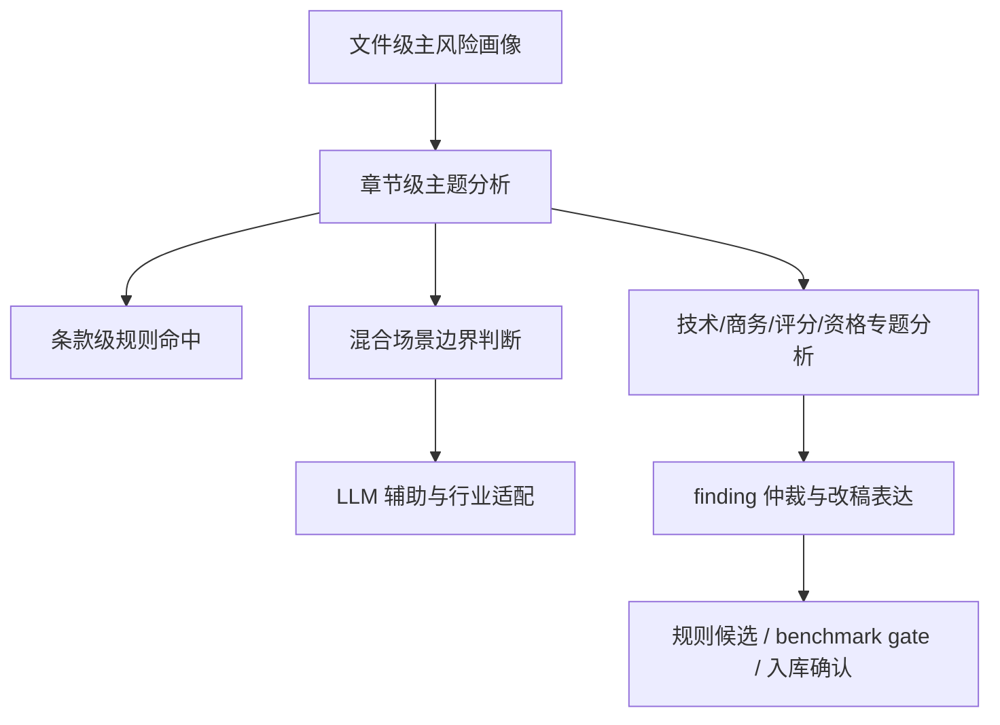

# 代码审查与人工审查差距收敛路线图

## 1. 文档目标

本文档用于回答一个更具体的问题：

> 当前代码审查距离人工式审查还差什么，后续应该补哪些能力模块，按什么顺序补，才能持续逼近人工式审查。

本文档不再讨论“是否需要代码化”，而直接面向“如何让代码审查变得更像人工审查”。

## 2. 当前差距的核心判断

当前代码审查已经具备：
- 文档标准化
- 规则初筛
- 章节级主问题归并
- 本地模型辅助审查
- finding 仲裁
- 规则候选与 benchmark gate

但与人工式审查相比，仍存在三类本质差距：

### 2.1 文件级整体理解不足

人工审查通常会先形成这类判断：
- 这是什么类型的采购
- 采购对象和履约方式是什么
- 核心竞争环节在哪
- 主要风险是资格、评分、技术还是商务

当前代码更多是“条款扫描 -> 主题归并”，还没有一个真正稳定的“整份文件主风险画像”层。

### 2.2 场景边界与分寸感不足

人工审查的优势不只是“发现问题”，还包括：
- 区分明显不当与需论证问题
- 判断混合采购场景中的合理边界
- 不会把所有不常见条款都说死

当前代码已经有 `needs_human_review` 和“需论证”类 finding，但场景边界和分寸感仍弱于人工。

### 2.3 输出仍未完全达到人工改稿感

当前代码已经能生成章节级主问题，但仍会出现：
- 主题对了，拆分不够自然
- 代表性证据不够像人工会挑的原文
- 改写建议可用，但还不够像正式改稿意见

## 3. 目标能力图谱

后续应把代码审查从“章节级结构化审查器”继续升级为“文件级审查员”。

目标能力结构：

## 4. 需要新增或增强的关键能力

### 4.1 `document_level_judgment_engine`

目标：
- 对整份文件先做总体风险画像，再进入局部条款判断。

需要回答：
- 这份文件的审查重心在哪
- 哪几个章节最可能产生主问题
- 应优先生成哪些章节级主问题

预期输出：
- `document_risk_profile`
- `dominant_risk_axes`
- `priority_sections`
- `expected_main_issue_groups`

价值：
- 让后续仲裁更有“文件级主线”
- 减少条款命中后过度碎片化

### 4.2 `mixed_scope_boundary_engine`

目标：
- 处理混合采购场景下的合理边界与错位条款判断。

典型场景：
- 药品 + 自动化设备 + 信息化接口
- 货物 + 服务 + 运维
- 平台建设 + 演示 + 驻场
- 医疗设备 + 耗材 + 售后保障

需要回答：
- 哪些配套要求属于合理履约延伸
- 哪些要求已经越过采购标的边界
- 哪些要求属于模板错贴

### 4.3 `qualification_reasoning_engine`

目标：
- 在现有 `qualification_bundle_analyzer` 基础上，进一步建立“准入条件与履约相关性”的判断能力。

需要增强的方面：
- 一般门槛 vs 特殊必要条件
- 属地要求 vs 服务保障要求
- 经营年限/规模门槛 vs 履约能力证明
- 错位资质 vs 行业必要许可

### 4.4 `scoring_semantic_consistency_engine`

目标：
- 判断评分项名称、评分目的、评分证据、评分内容之间是否一致。

典型问题：
- 方案评分混入案例或证明形式
- 商务评分混入营收、净利润、资产、注册资本
- 团队评分混入不匹配证书或过度堆叠学历/职称/荣誉
- 认证评分混入明显不相关的企业称号

### 4.5 `personnel_certificate_mismatch_engine`

目标：
- 单独补强人员、岗位、证书、职称、学历、奖项之间的错位与堆叠问题。

重点识别：
- 岗位与证书不匹配
- 团队条件过度堆叠
- 以学历、职称、荣誉替代真实履约能力
- 跨领域证书被直接引入评分或资格

### 4.6 `demo_mechanism_engine`

目标：
- 将演示机制作为独立主轴处理，而不是混在一般评分问题里。

重点识别：
- 演示分值过高
- 可运行系统 vs 原型/PPT 的评分差距
- 签到/到场/现场条件形成的额外门槛
- 既有成熟系统/本地组织能力倾向

### 4.7 `technical_necessity_explainer`

目标：
- 让技术问题的“需论证”表达更接近人工式审查意见。

需要增强：
- 为什么该要求可能过严
- 为什么它未必当然违规
- 若采购人坚持，应补哪些论证
- 是否存在更中性的替代表达

### 4.8 `commercial_lifecycle_analyzer`

目标：
- 从履约全链路而不是单句，审查商务与验收条款。

需要覆盖：
- 交货
- 安装
- 驻场
- 验收
- 抽检/复检
- 付款
- 履约评价
- 扣款
- 解除

### 4.9 `evidence_selector`

目标：
- 让代表性证据更像人工挑选的原文。

要解决的问题：
- 当前代表性摘录有时跨度偏大
- 证据不够集中
- 不够利于业务方快速改稿

### 4.10 `difference_learning_loop`

目标：
- 把“人工 vs 代码”的差异自动沉淀为持续优化材料。

要覆盖：
- 漏判
- 误判
- 过碎
- 合并过头
- 定性不准
- 理由偏弱

## 5. 从差距到模块的映射

| 差距 | 需要补的模块 |
|---|---|
| 文件级主线不强 | `document_level_judgment_engine` |
| 混合场景边界判断不稳 | `mixed_scope_boundary_engine` |
| 准入门槛与履约相关性解释不足 | `qualification_reasoning_engine` |
| 评分项语义一致性不足 | `scoring_semantic_consistency_engine` |
| 团队/证书/岗位错位判断不足 | `personnel_certificate_mismatch_engine` |
| 演示机制判断还不独立 | `demo_mechanism_engine` |
| 技术“需论证”说明不够自然 | `technical_necessity_explainer` |
| 商务与验收仍偏条款化 | `commercial_lifecycle_analyzer` |
| 证据摘取不够像人工 | `evidence_selector` |
| 自动优化闭环不够完整 | `difference_learning_loop` |

## 6. 分阶段开发顺序

### P0：把系统从“章节审查器”升级到“文件审查器”

优先实现：
- `document_level_judgment_engine`
- `mixed_scope_boundary_engine`
- `scoring_semantic_consistency_engine`
- `commercial_lifecycle_analyzer`

完成标志：
- 新样本上可先形成文件级主风险画像
- 主问题数进一步减少但信息不丢失
- 混合采购场景下的误判下降

### P1：把边界判断和改稿表达拉近人工

优先实现：
- `qualification_reasoning_engine`
- `personnel_certificate_mismatch_engine`
- `demo_mechanism_engine`
- `technical_necessity_explainer`
- `evidence_selector`

完成标志：
- 风险说明更像人工式审查意见
- 代表性证据更利于业务方改稿
- 评分、人员、演示类问题更稳

### P2：把持续优化闭环跑顺

优先实现：
- `difference_learning_loop`
- 差异样本自动标注
- 规则候选自动质量评估
- benchmark 自动回归报告

完成标志：
- 每轮增强都能说明“比上一版哪里更接近人工”
- 规则候选与 benchmark gate 真正形成稳定闭环

## 7. 结果判断标准

后续不要只看“finding 数量多不多”，而要看这 4 类指标：

### 7.1 查点覆盖率
- 人工常见主问题，代码覆盖了多少

### 7.2 主问题收束度
- 代码是否能把碎点压成更少、更自然的主问题

### 7.3 定性准确率
- 是否更少出现 `other`
- 是否更少“看到了但定错类”

### 7.4 改稿可用性
- 风险说明和建议改写是否更像正式审查意见

## 8. 与现有架构的关系

本路线图不是替代当前架构，而是补在现有主线之上：

- 现有基础：
  - 标准化
  - 规则初筛
  - 结构分析
  - LLM 辅助
  - finding 仲裁
  - rule candidates
  - benchmark gate

- 后续新增重点：
  - 文件级主风险画像
  - 混合场景边界判断
  - 评分语义一致性
  - 商务全链路分析
  - 自动差异学习

## 9. 一句话结论

代码审查后续不该再以“补几条规则”为主，而应该沿着：

`文件级主线 -> 场景边界 -> 章节主题 -> 改稿表达 -> 差异学习闭环`

这条路线持续升级，才能真正逼近人工式审查能力。
