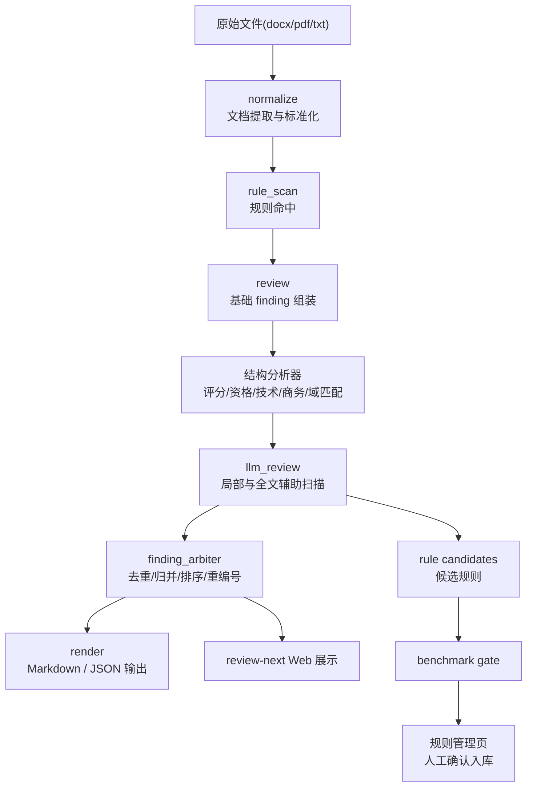

# 代码审查能力技术说明

## 1. 文档目标

本文档用于完整描述本项目当前“代码审查链路”的功能边界、系统架构、处理流程、输入输出和持续优化机制，供以下场景使用：
- 技术方案评审
- 新成员理解系统
- 与外部系统进行能力对接
- 后续智能体在本仓库内继续迭代

本文档描述的对象是本地代码化审查系统，而不是纯对话式人工审查能力。

## 2. 总体定位

当前代码审查系统是一个面向政府采购需求合规性审查的本地执行引擎。它的目标不是把整份文件直接交给大模型自由判断，而是构建一条：

`文档标准化 -> 规则初筛 -> 结构分析 -> 本地知识检索 -> LLM 辅助 -> finding 仲裁 -> 结果输出 -> 规则候选与 benchmark gate`

的可复用、可复审、可持续优化流水线。

系统设计原则：
- 本地优先，离线可运行
- 规则优先，模型补边界
- 输出结构化，可定位、可追溯
- 复审优先复用缓存，不重复整篇自由推理
- 每次增强都要能映射为 benchmark 和规则候选

## 3. 功能范围

### 3.1 审查对象

当前代码审查覆盖：
- 资格条件
- 评分标准
- 技术要求
- 商务条款
- 验收与检测
- 付款与违约
- 模板残留与义务外扩

输入文件类型：
- `docx`
- `pdf`
- `txt`

### 3.2 主要问题类型

当前系统已支持识别或归并的主题包括：
- 一般财务和规模门槛
- 经营年限、属地场所、单项业绩门槛
- 与标的域不匹配的行业资质或专门许可
- 品牌档次直接评分
- 认证评分混入错位证书、企业称号、荣誉和跨领域内容
- 多个方案评分项使用主观分档且缺少量化锚点
- 演示分值过高、签到或到场要求形成额外门槛
- 驻场、短时响应或服务场地要求形成事实上的属地倾斜
- 技术标准引用错位
- 技术证明材料形式要求过严、地方化或机构限定
- 模板残留、义务外扩、领域错贴
- 商务异常资金占用
- 交货期限异常
- 验收费、送检费、专家评审费转嫁
- 商务责任失衡、违约后果偏重
- 验收程序、复检与最终确认边界不清

## 4. 系统架构



### 4.1 代码模块

- `src/agent_compliance/parsers/`
  - 文本抽取、章节切分、分页映射
- `src/agent_compliance/rules/`
  - 确定性规则引擎
- `src/agent_compliance/pipelines/normalize.py`
  - 标准化输入生成
- `src/agent_compliance/pipelines/rule_scan.py`
  - 规则命中执行
- `src/agent_compliance/pipelines/review.py`
  - finding 组装、主题分析器、仲裁层
- `src/agent_compliance/pipelines/llm_review.py`
  - 本地模型辅助审查
- `src/agent_compliance/pipelines/llm_enhance.py`
  - LLM 文案增强
- `src/agent_compliance/knowledge/references_index.py`
  - 本地法规和案例检索
- `src/agent_compliance/cache/`
  - review 缓存与复审复用
- `src/agent_compliance/web/app.py`
  - 本地网页入口、规则管理页、review-next
- `src/agent_compliance/evals/runner.py`
  - benchmark 汇总与 gate 入口

### 4.2 关键数据结构

核心 schema 定义在 [schemas.py](/Users/linzeran/code/2026-zn/agent_compliance/src/agent_compliance/schemas.py)：
- `NormalizedDocument`
- `Clause`
- `RuleHit`
- `Finding`
- `ReviewResult`

其中：
- `NormalizedDocument` 表示标准化后的文件及条款切分结果
- `RuleHit` 表示规则命中
- `Finding` 表示最终输出问题项
- `ReviewResult` 表示完整审查结果

## 5. 处理流程

### 5.1 标准化阶段

入口：
- CLI `normalize`
- CLI `review`
- Web `/api/review`

处理内容：
- 提取正文
- 生成稳定文本副本
- 构建 `clauses`
- 建立 `page_map`
- 为每个条款生成 `section_path`、`source_section`、`table_or_item_label`

产物：
- `normalized_text_path`
- `file_hash`
- `clauses`
- `page_map`

### 5.2 规则初筛阶段

入口：
- `run_rule_scan(normalized)`

处理内容：
- 在资格、评分、技术、商务四类规则集中执行匹配
- 输出 `RuleHit`
- 使用 `merge_key` 和行号控制局部聚合基础

价值：
- 先用确定性规则抓高频显性问题
- 为后续结构分析和模型辅助提供候选输入

### 5.3 基础 finding 组装阶段

入口：
- `build_review_result(normalized, hits)`

处理内容：
- 对相邻命中做基础聚合
- 结合 `references_index` 补法规和案例依据
- 生成 `Finding`
- 构建 `ReviewResult`

### 5.4 主题分析阶段

当前已落地的主题分析器包括：
- `qualification_bundle_analyzer`
- `brand_and_certification_scoring_analyzer`
- `scoring_structure_analyzer`
- `commercial_chain_analyzer`
- `technical_reference_consistency_engine`
- `commercial_burden_analyzer`
- `domain_match_engine`
- `geographic_tendency_analyzer`
- `acceptance_boundary_analyzer`
- `liability_balance_analyzer`
- `proof_formality_analyzer`
- `industry_appropriateness_analyzer`
- `theme_splitter_and_summarizer`

职责：
- 把碎点提升为章节级主问题
- 把相近问题拆为更利于改稿的子主题
- 让代码输出更接近人工式审查意见

### 5.5 LLM 辅助阶段

入口：
- `apply_llm_review_tasks(...)`

当前原则：
- 默认关闭
- 仅在 `--use-llm` 或 Web 勾选时启用
- 作为辅助审查员，而不是最终裁判

当前任务类型：
- 模板错贴与标的域不匹配
- 评分结构判断
- 商务链路联合判断
- 全文辅助扫描

输出行为：
- 可新增 `llm_added` 类型 finding
- 可生成规则候选和 benchmark gate 产物
- 新增问题必须先进入仲裁层

### 5.6 finding 仲裁阶段

入口：
- `reconcile_review_result(review)`
- `_apply_finding_arbiter(...)`

职责：
- 去重
- 压掉被主问题覆盖的碎点
- 排序
- 重编号
- 重算摘要
- 保留代表性证据

目标：
- 从“很多细小命中”压缩成“少数主问题 + 代表性证据 + 直接建议”

### 5.7 输出阶段

输出方式：
- Markdown 审查意见
- JSON findings
- Web 展示

输出文件默认在：
- `docs/generated/reviews/`

## 6. 当前 CLI、API 与页面能力

### 6.1 CLI

入口在 [cli.py](/Users/linzeran/code/2026-zn/agent_compliance/src/agent_compliance/cli.py)。

当前命令：
- `normalize <file>`
- `scan-rules <file>`
- `review <file>`
- `eval`
- `web`

典型命令：

```bash
PYTHONPATH=src python3 -m agent_compliance review <file> --json
PYTHONPATH=src python3 -m agent_compliance review <file> --json --use-llm
PYTHONPATH=src python3 -m agent_compliance web
```

### 6.2 Web API

当前主要接口：
- `POST /api/review`
- `POST /api/open-source`
- `GET /api/rules`
- `POST /api/rules/decision`

### 6.3 Web 页面

当前页面：
- `/` 旧版审查页
- `/review-next` 新版审查页
- `/rules` 规则管理页

`/review-next` 当前重点能力：
- 高风险优先
- 章节级主问题视图
- 资格/评分/技术/商务分组
- 定位到文档原文
- 高亮问题文字
- 展示代表性证据、风险说明、建议改写

## 7. 规则候选与持续优化

### 7.1 自动生长链路

当前已形成：

`模型辅助审查 -> 新问题沉淀 -> rule_candidate -> benchmark gate -> 规则管理确认入库`

生成产物目录：
- `docs/generated/improvement/*-rule-candidates.json`
- `docs/generated/improvement/*-benchmark-gate.json`

### 7.2 规则管理

规则管理页职责：
- 查看正式规则
- 查看候选规则
- 查看 gate 状态
- 执行：
  - `确认入库`
  - `暂缓`
  - `忽略`

## 8. 输出约定

每条 finding 至少包含：
- 问题标题
- 章节位置
- 原文摘录
- 问题类型
- 风险等级
- 合规判断
- 风险说明
- 法律/政策依据
- 改写建议
- 是否需要人工复核

这套约定与 [finding-schema.md](/Users/linzeran/code/2026-zn/agent_compliance/docs/product-specs/finding-schema.md) 对齐。

## 9. 当前边界

当前系统仍有这些边界：
- 长文档上的 LLM 稳定性仍需继续压
- `docx` 页码仍以估算页提示为主
- 某些混合采购场景还需要更多 benchmark 样本
- 章节级主问题已经成型，但代表性证据与改稿表达仍在继续逼近人工

## 10. 适合的对外表述

可以将本系统描述为：

“一个面向政府采购需求合规审查的本地代码化执行引擎，支持文档标准化、规则审查、章节级问题归并、本地模型辅助、结构化输出、文档定位、规则候选生成和 benchmark gate，可持续逼近人工式审查效果。”
