# 大模型混合审查模式设计

## 一、目标

在“采购需求合规性审查智能体”主链路中，大模型应继续介入关键环节，但定位必须准确：

- 不替代规则、品目、主题分析器和仲裁层的主干职责
- 不把整条审查链路变成不可控的全文自由推理
- 在保持速度和稳定性的前提下，让结果更接近人工审查

因此，后续大模型接入不再定义为“模型接管整条链路”，也不再简单定义为“两段式双轨结果”，而应采用：

- **代码审查主骨架**
- **大模型关键节点同步介入**
- **统一进入仲裁层和置信度层**

的混合审查模式。

## 二、设计原则

### 1. 结构化主链负责稳定

以下主链能力必须由本地结构化逻辑主导：

- 文档解析与标准化
- 采购阶段路由
- 品目分类与品目知识画像
- 规则扫描
- 主题分析器
- 仲裁归并
- 证据选择
- 法规条文级基础映射
- 置信度校准

这部分是：

- 首轮结果的稳定来源
- 断网或模型不可用时的最低保证
- 性能和一致性的基础

### 2. 大模型负责“像人工”的关键层

大模型最适合介入但不接管的环节包括：

- 全文辅助扫描
- 章节级总结
- 法规适用逻辑解释
- 差异学习与规则候选归纳

这四层的共同特点是：

- 纯规则难完全覆盖
- 对人工审查逼近度影响很大
- 适合在结构化骨架之上做增强

### 3. 所有模型产出必须进入仲裁

大模型产生的候选结果，不应直接成为最终 findings。

统一进入：

- `finding_arbiter`
- `legal_authority_reasoner`
- `confidence_calibrator`
- `evidence_selector`

由这几层决定：

- 是否上浮
- 风险等级
- 是否需复核
- 代表性证据
- 最终输出表达

## 三、关键介入点

## 3.1 全文辅助扫描

### 作用

- 看规则和 analyzer 没稳定抓住的边界问题
- 补章节主问题候选
- 发现混合采购边界、模板错贴、错位义务

### 适合原因

- 这类问题经常不是单一显性规则能稳定抓住的
- 是当前最重要的一层模型介入点

### 接入方式

- 输入：已标准化文档、品目分类、品目画像高风险、当前规则/analyzer 主问题
- 输出：候选 findings，不直接定案

## 3.2 章节级总结

### 作用

- 把评分、技术、商务、资格章节里的碎点收成更像人工的话
- 帮助输出章节主问题
- 让结果更接近人工审查意见，而不是一堆点状 findings

### 接入方式

- 输入：同章节的规则命中、主题分析结果、代表性条款
- 输出：章节主问题候选、章节级表达优化建议

## 3.3 法规适用逻辑解释

### 作用

- 在已有 `issue_type_authority_map + legal_clause_index` 基础上
- 生成更自然的“为什么这条法规适用于这个问题”
- 说明哪些属于“需论证/需复核”

### 接入方式

- 输入：当前 finding、主依据、辅依据、条文级索引
- 输出：
  - `legal_or_policy_basis`
  - `applicability_logic`
  - 法规侧 `needs_human_review` 理由增强

## 3.4 差异学习与规则候选归纳

### 作用

- 从“人工 vs 代码”的差异里总结：
  - 缺了什么规则
  - 哪个 analyzer 不够
  - 哪类 prompt 该补
- 把经验沉淀为候选规则和 benchmark 建议

### 接入方式

- 输入：差异样本、当前品目场景、已有 findings
- 输出：
  - `rule_candidates`
  - `difference_learning`
  - `benchmark` 增强建议

## 四、主链与模型协同结构

```mermaid
flowchart LR
    A["Normalize"] --> B["Stage Router"]
    B --> C["Catalog Classifier"]
    C --> D["Rule Scan"]
    D --> E["Analyzers"]
    E --> F["LLM Key Steps"]
    F --> G["Finding Arbiter"]
    G --> H["Legal Authority Reasoner"]
    H --> I["Confidence Calibrator"]
    I --> J["Evidence Selector"]
    J --> K["Review Result"]
    K --> L["Difference Learning / Rule Candidates"]
```

其中：

- `Rule Scan + Analyzers` 负责稳定主骨架
- `LLM Key Steps` 负责边界、总结、解释、学习
- `Finding Arbiter` 负责统一裁决

## 五、模块分工

### 代码主导层

负责：

- 稳定
- 速度
- 可控
- 可缓存

包括：

- 品目分类
- 品目知识画像
- 规则治理
- 高频显性规则
- 章节主题分析器
- 仲裁框架
- 法规基础映射

### 大模型增强层

负责：

- 边界问题补点
- 章节主问题总结
- 法规适用逻辑润色
- 差异学习归纳

### 汇总裁决层

负责：

- 去重
- 上浮
- 风险等级
- 需复核判断
- 代表性证据
- 最终输出

## 六、哪些地方不该让大模型主导

为了保证速度和稳定性，下列环节仍应由结构化逻辑主导：

- 品目分类主链
- 规则命中
- 正文定位
- 最终风险等级主裁决
- finding 编号和归并主框架

这意味着：

- 大模型是增强层，不是底座层
- 结果必须是“结构化主链 + 模型增强”的统一产物

## 七、速度约束

混合模式并不意味着可以任意增加模型调用。

默认仍然遵守：

- 少量调用
- 章节级短上下文
- 命中密度驱动调用
- 候选片段优先
- 结果可缓存
- 对采购人首轮查看不造成长时间阻塞

### 推荐调用优先级

优先调用：

- 资格章节
- 评分章节
- 技术章节
- 商务/验收章节

优先看：

- 高风险密集段
- 混合采购可疑段
- 错位认证/资质密集段
- 需论证问题密集段

避免：

- 整份文件无筛选长调用

## 八、页面展示建议

### `review-check`

面向采购人：

- 先展示结构化主链得到的稳定审查结果
- 再补充模型增强信息
- 但页面重点仍然是：
  - 风险说明
  - 法规依据
  - 适用逻辑
  - 建议改写
  - 原文定位

### `review-next`

继续作为内部增强验证页：

- 看模型新增
- 看仲裁效果
- 看 Difference Learning
- 看 benchmark 解释

## 九、实施优先级

### P0

- 明确主链里的模型关键介入点
- 让 `document_audit_llm`
- `chapter_summary_llm`
- `legal_reasoning_llm`
  都进入统一仲裁

### P1

- 为三类模型介入点分别做输入压缩
- 做章节候选选择器
- 做章节级模型缓存

### P2

- 让差异学习完全异步化
- benchmark 对比“纯结构化主链”与“混合模式”收益

## 十、一句话结论

后续大模型接入应采用：

- 代码负责稳
- 大模型负责“像人工”
- 仲裁层负责把两者收成最终结果

也就是：

**代码审查主骨架 + 大模型关键节点同步介入 + 统一仲裁输出**
