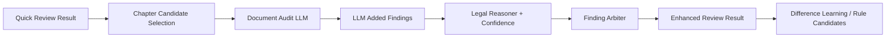

# 大模型双轨加速设计

## 一、目标

在“采购需求合规性审查智能体”主链路中，大模型应继续介入关键环节，但必须满足两个前提：

- 不拖慢采购人首轮查看结果的速度
- 不替代规则、品目、主题分析器和仲裁层的主干职责

因此，后续大模型接入不再走“整链路等待模型完成”的模式，而采用：

- `快速模式`
- `增强模式`

双轨并行思路。

## 二、设计原则

### 1. 结构化主链先出结果

首轮结果必须由以下本地结构化主链独立完成：

- 文档解析与标准化
- 采购阶段路由
- 品目分类与品目知识画像
- 规则扫描
- 主题分析器
- 仲裁归并
- 证据选择
- 法规语义推理
- 置信度校准

这部分必须不依赖 LLM，确保：

- 首屏结果稳定
- 速度可预期
- 断网或模型不可用时仍能工作

### 2. 大模型只做高价值补点

大模型应定位为：

- 边界问题补点器
- 章节主问题总结器
- 法规适用逻辑润色器
- 差异学习归纳器

不应定位为：

- 全文主裁判
- 规则扫描替代器
- 最终 finding 唯一生成器

### 3. 模型调用必须少量、短上下文、可缓存

后续设计默认遵守：

- 少量调用
- 章节级短上下文
- 可根据命中密度跳过
- 可缓存
- 可异步

## 三、双轨模式

## 3.1 快速模式

### 定位

优先给采购人一个“可立即复核和改稿”的基础结果。

### 包含能力

- 采购阶段判断
- 品目分类
- 品目知识画像
- 规则扫描
- 主题分析器
- `finding_arbiter`
- `evidence_selector`
- `legal_authority_reasoner`
- `confidence_calibrator`

### 不等待的内容

- 全文辅助扫描 LLM
- 章节总结型 LLM
- 差异学习型 LLM

### 输出特点

- 速度优先
- 结果稳定
- 适合采购人第一轮快速查看

## 3.2 增强模式

### 定位

在快速模式结果基础上，继续补边界问题和章节级表达。

### 包含能力

- `document_audit_llm`
- 局部评分结构补点
- 商务链路联合判断补点
- 章节级主问题补充
- 法规适用逻辑润色
- 差异学习和规则候选归纳

### 输出特点

- 更接近人工审查
- 更适合复盘、规则生长、benchmark 归纳
- 不阻塞快速结果

## 四、建议调用策略

### 4.1 默认策略

- 默认先返回快速模式结果
- 如果启用本地模型，再继续异步补增强结果

### 4.2 章节调用策略

避免全文长调用，优先：

- 资格章节
- 评分章节
- 技术章节
- 商务/验收章节

并按命中密度和品目场景选择是否调用。

### 4.3 候选片段调用策略

优先让大模型只看：

- 高风险密集章节
- 混合采购可疑段
- 错位认证/资质密集段
- 需论证问题密集段

而不是整份文件自由阅读。

## 五、模块分工

### 快速模式主链

### 增强模式补点链

## 六、页面展示建议

### `review-check`

默认优先展示：

- 快速模式结果
- 当前阶段定位
- 风险摘要
- 高风险问题
- 原文定位
- 法规依据
- 建议改写

如启用本地模型，可追加显示：

- 模型增强已完成
- 模型新增问题数量

但不应让采购人等待增强结果后才能开始看。

### `review-next`

继续作为内部增强验证页，适合展示：

- 模型新增
- 仲裁效果
- Difference Learning
- benchmark 解释

## 七、缓存与性能建议

### 快速模式缓存

缓存：

- 标准化输入
- 规则命中
- 结构化 findings
- 文件级策略

### 增强模式缓存

缓存：

- 章节级模型调用结果
- LLM 增强 findings
- 差异学习结果

避免：

- 整份文件重复长调用

## 八、实施优先级

### P0

- 在主链中显式拆出 `quick_review` 和 `enhanced_review`
- `review-check` 优先展示快速结果
- 模型增强改成异步或二阶段触发

### P1

- 章节候选选择器
- 章节级模型缓存
- 页面展示“增强完成”状态

### P2

- 差异学习完全异步化
- benchmark 对比“快速模式 / 增强模式”收益

## 九、一句话结论

后续大模型接入应采用：

- 规则与结构化主链负责速度
- 大模型负责边界、总结、解释、学习
- 先返回快速结果，再异步补增强结果

这样才能同时满足：

- 采购人发布前快速复核
- 结果继续向人工审查逼近
